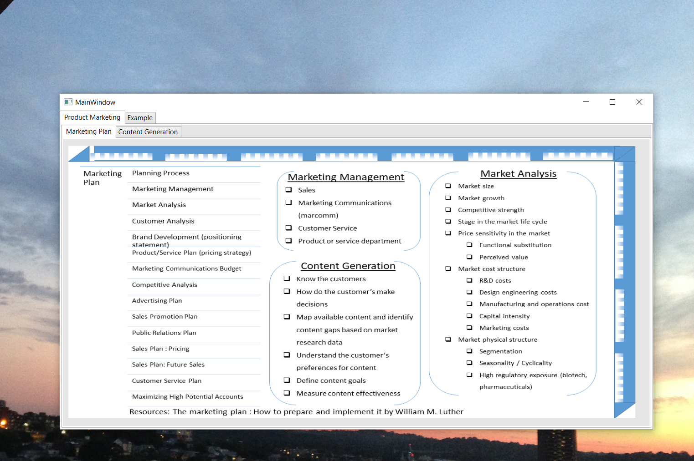
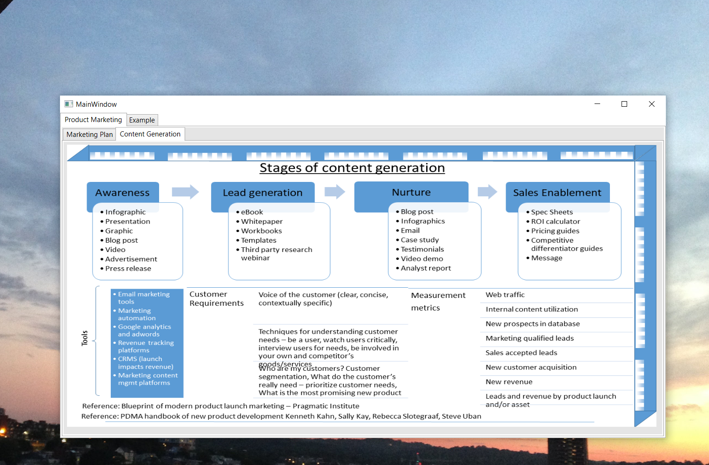
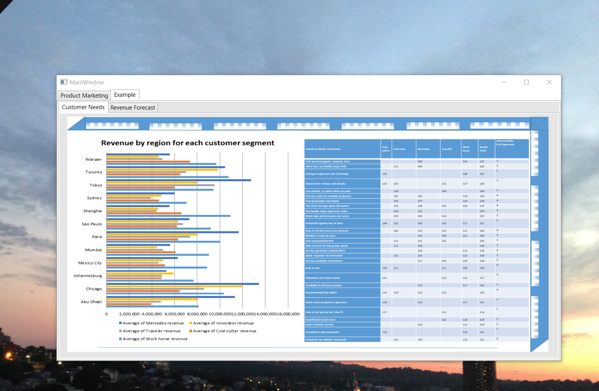
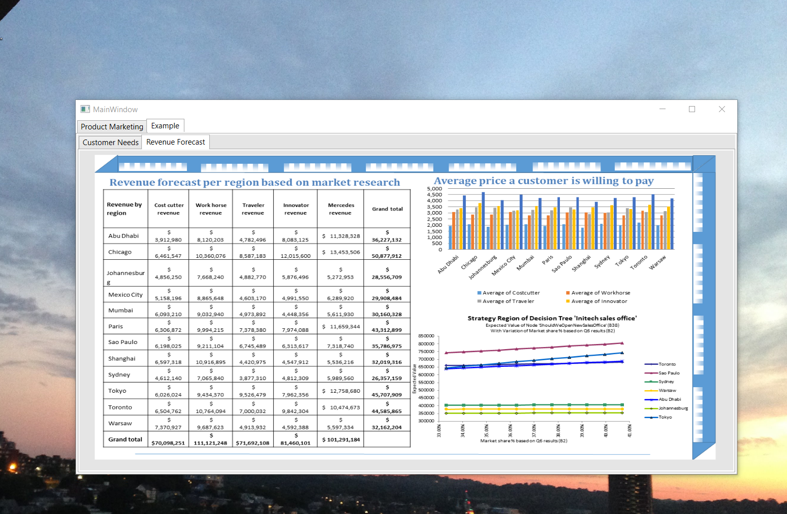
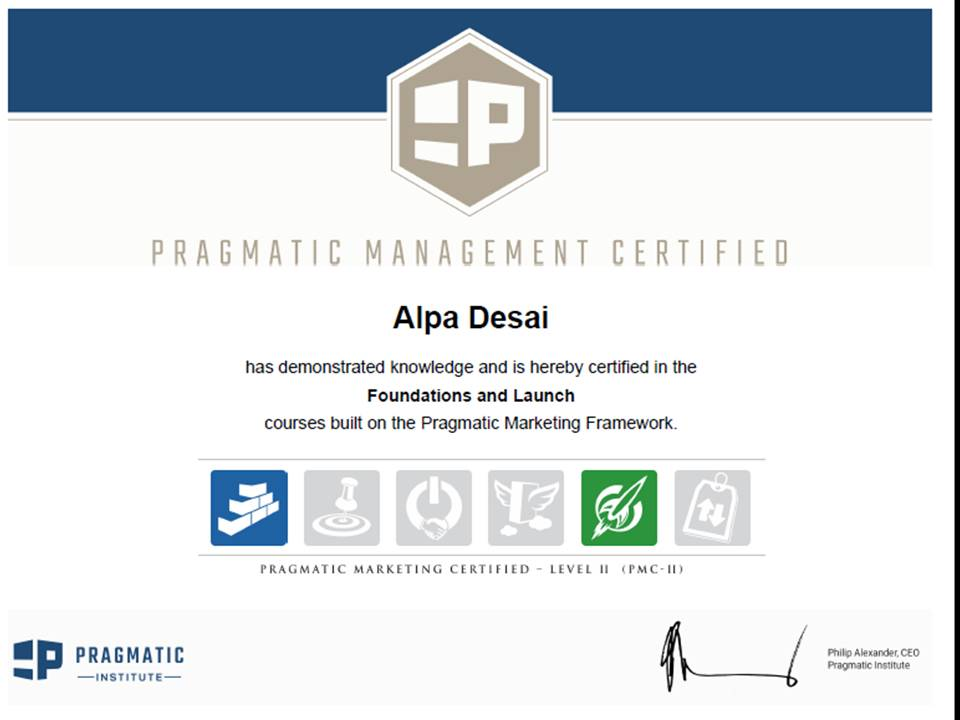
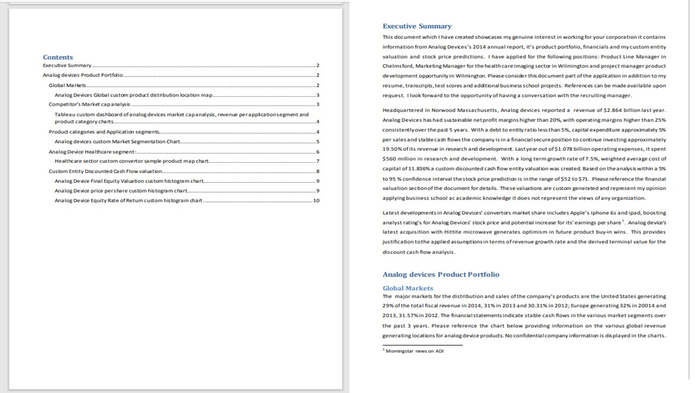
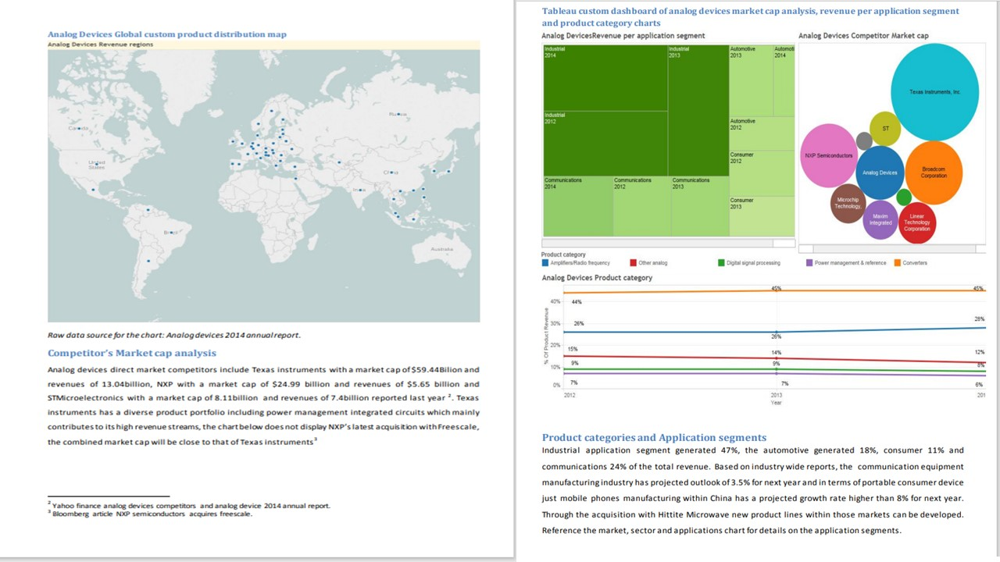
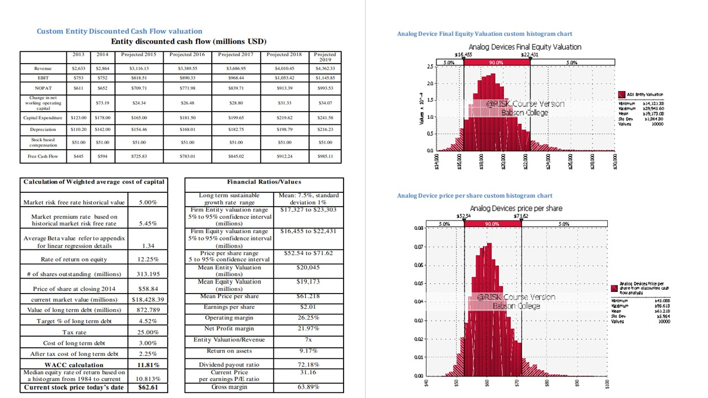
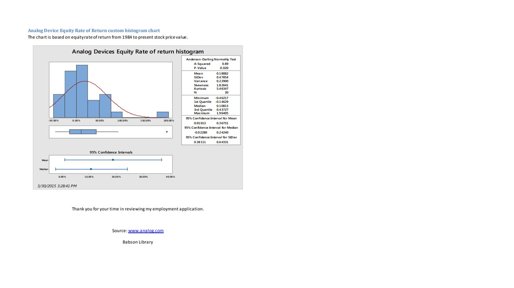

# Product Marketing

The project provides an introduction to creating a marketing plan, content generation and examples.

Images are custom. Confidential information is not displayed.

Please download the executable in https://github.com/alpaddesai/ProductMarketing/releases

## Marketing Plan 

## Content Generation

## Customer Needs

## Revenue Forecast, Brand Management

## Exam

## Pragmatic Marketing 

## Product Marketing 

## Ethics and Excellence

Also reference https://github.com/alpaddesai/TechnicalProductManagement and https://github.com/alpaddesai/SystemLevelDesignProductPortfolioIdea for further details.
