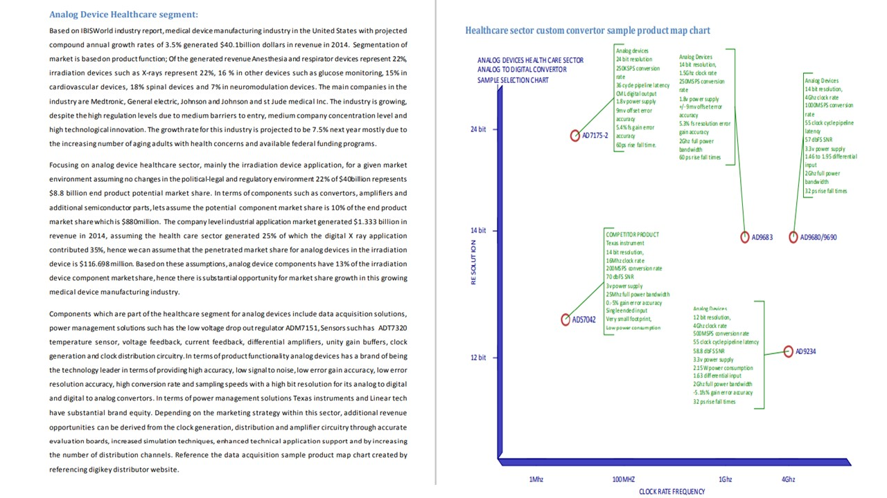

# Product Marketing

The project provides an introduction to creating a marketing plan, content generation and examples.

Images are custom. Confidential information is not displayed.

## Marketing Plan 

## Content Generation

## Customer Needs

## Revenue Forecast, Brand Management

## Product Marketing 

## Pragmatic certification

## Ethics and Excellence

Also reference https://github.com/alpaddesai/BusinessDevelopmentMergersAcquisitionsIdea
